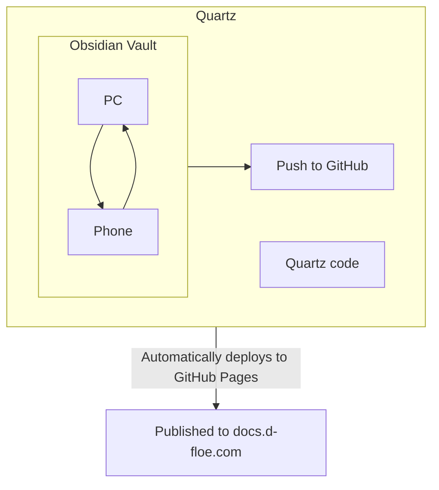

![[_index.png]]

Welcome to d-floe's documents. Feel free to browse and look around. This site is still very much a work-in-progress.

## What is this?

I use this website a bit like a second brain. Life is hectic and complicated; it can be incredibly easy to forget vital or useful information. Writing down all the stuff in your brain is a great way to clear your thoughts, and focus on important things, rather than needing to commit everything you know to memory.

Initially this project was going to remain as a private and personal journal, but I found myself wanting to share some parts of it with the rest of the world. A great example of this would be my [[art]] guides or personal [[keyboard-index|keyboard]] documents.

## How did you set this up?

To make publishing to this website as smooth as possible without burning a massive hole in my pockets, I use 3 different tools to accomplish ease of use.

### Obsidian

For writing, I use a simple yet intricate Markdown-based writing tool called **Obsidian**. You can sort of think of Obsidian Markdown as a really streamlined version of HTML without all the headache inducing elements and tags. The last thing you need to be obsessing over when you're writing is general formatting and best practices. Obsidian has many useful plugins to customize and streamline your experience, and best of all its completely free and open-source.

### Syncthing

To synchronize my Obsidian vault with my phone for note-taking on the go, I use a free program called **Syncthing**. Syncthing allows you synchronize the files from one device to another completely for free as long as both devices are online. This is how I am able to make sure that the notes on my PC are identical to the notes on my phone.

### Quartz

The third and final tool in my arsenal — and the whole reason this website is able to be public in the first place — is a handy, lightweight and open-source framework called **Quartz**. Quartz makes publishing Obsidian vaults a breeze, and since its all pushed and handled through GitHub, I can rest easy knowing that the changes I make in my notes will be published without needing to worry. I use an Obsidian plugin called **Obsidian Git** to regularly push changes to the GitHub repository, and Quartz will automatically deploy the changes to the finished website. Not a dime out of my pocket spent.

I already pay for the d-floe.com domain for a mere pittance, so being able to handle everything for free with just a bit of extra on-boarding effort is well worth the long-lasting benefits.

For comparison, Obsidian's proprietary syncing and publishing tools both cost 96 USD/year or 10 USD/month **each**. It certainly comes with added convenience, but like most things in life, there's a trade-off for going cheap.

> [!hidden]
>
> -   📁 [[_index]] (You are here)
>     -   📂[[art]]
>         -   📄 [[color-precision|Achieving Color Precision]]
>         -   📄 [[clothing-and-folds|Clothing and Folds]]
>         -   📄 [[commission-sheet|Commission Info]]
>     -   📁 [[keyboard-index|keyboards]]
>         -   📂 [[tags/keycaps]]
>         -   📂 [[tags/switches]]
>         -   📂 [[tags/stabilizers]]
>         -   📂 [[tags/misc]]
