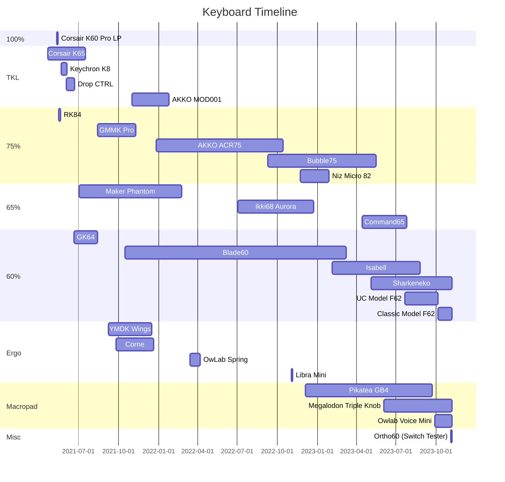

## Currently Own

<ul class="card-reel">
	

			![[23_Classic-Model-F62.png]]
			[[23_Classic-Model-F62|Classic Model F62 - 60%]]
	

	

			![[21_Sharkeneko-60-14.png]]
			[[21_Sharkeneko-60|Sharkeneko - 60%]]
	

	

			![[25_Typ65+-8.png]]
			[[25_Typ65+|Typ65+ - 65%]]
	

</ul>

### Macropads

<ul class="card-reel">
	

			![[MACRO_Megalodon-Triple-Knob.png]]
			[[MACRO_Megalodon-Triple-Knob|Megalodon Triple Knob Macropad]]
	

	

			![[MACRO_OwLab-Voice-Mini.png]]
			[[MACRO_MACRO_OwLab-Voice-Mini|Owlab Voice Mini]]
	

</ul>

### Other

<ul class="card-reel">
		

				![[MISC_Ortho60-Switch-Tester-1.png]]
				[[MISC_Ortho60-Switch-Tester|Ortho60 (Switch Tester)]]
		

</ul>
## Future Projects

<ul class="card-reel">
		

				![[Beam-Spring-B62-Repro.jpg]]
				[[Beam-Spring-B62|Beam Spring B62 - 60%]]
		

</ul>

## Past Projects

<ul class="card-reel">
	

			![[24_Alps-60.png]]
			[[24_Alps-60|ALPS 60]]
	

	

			![[22_Ultra-Compact-Model-F62-24.png]]
			[[22_Ultra-Compact-Model-F62|Ultra Compact Model F62 - 60%]]
	

	

			![[MACRO_Pikatea-Macropad-GB4.jpg]]
			[[MACRO_Pikatea-Macropad-GB4|Pikatea Macropad GB4]]
	

	

			![[20_Command65-Exploded-65.png]]
			[[20_Command65-Exploded-65|Command65 - Exploded 65%]] 
	

	

			![[cmm-isabell.jpg]]
			[[19_CMM-Studio-Isabell-60|CMM.Studio Isabell - 60%]] 
	

	

			![[niz-micro-82.png]]
			[[18_Niz-Micro-82-Condensed-75|Niz Micro 82 - Condensed 75%]] 
	

	

			![[libra-mini.jpg]]
			[[17_Libra-Mini-40-Tented-Alice|Libra Mini - 40% Tented Alice]] 
	

	

			![[bubble75.jpg]]
			[[16_Velocifire-Bubble75-Condensed-75|Velocifire Bubble75 - Condensed 75%]] 
	

	

			![[ikki68-aurora.jpg]]
			[[15_Wuque-Ikki68-Aurora-68|Wuque Ikki68 Aurora - 68%]] 
	

	

			![[owlab-spring.jpg]]
			[[14_OwLab-Spring-Arisu|OwLab Spring - Arisu]] 
	

	

			![[akko-acr75.jpg]]
			[[13_Akko-ACR-75-Condensed-75|Akko ACR 75 - Condensed 75%]] 
	

	

			![[akko-mod001.jpg]]
			[[12_Akko-MOD-001-TKL|Akko MOD 001 - TKL]] 
	

	

			![[blade60.jpg]]
			[[11_KBDFans-Blade60-60|KBDFans Blade60 - 60%]]
	

	

			![[corne.jpg]]
			[[10_Corne-40-Split-Ortho|Corne - 40% Split Ortho]]
	

	

			![[ymdk-wings.jpg]]
			[[9_YMDK-Wings-Arisu|YMDK Wings - Arisu]] 
	

	

			![[gmmk-pro.jpg]]
			[[8_GMMK-Pro-Exploded-75|GMMK Pro - Exploded 75%]] 
	

	

			![[maker-phantom.jpg]]
			[[7_Maker-Phantom-65|Maker Phantom - 65%]] 
	

	

			![[gk64.jpg]]
			[[6_Skyloong-GK64-60|Skyloong GK64 - 60%]] 
	

	

			![[drop-ctrl.jpg]]
			[[5_Drop-CTRL-TKL|Drop CTRL - TKL]]
	

	

			![[keychron-k8.jpg]]
			[[4_Keychron-K8-TKL|Keychron K2 - TKL]]
	

	

		![[rk84.png]]
		[[3_Royal-Kludge-RK84-Compact-75|Royal Kludge RK84 - Compact 75%]] 
	

	

		![[corsair-k60.jpg]]
		[[2_Corsair-K60-RGB-Pro-Low-Profile-100|Corsair K60 RGB Pro Low Profile - 100%]]
	

	

			![[corsair-k65.jpg]]
			[[1_Corsair-K65-LUX-RGB-TKL|Corsair K65 LUX RGB - TKL]]
	

</ul>

> [!bug]
>
> > [[1_Corsair-K65-LUX-RGB-TKL]] [[2_Corsair-K60-RGB-Pro-Low-Profile-100]] [[3_Royal-Kludge-RK84-Compact-75]] [[4_Keychron-K8-TKL]] [[5_Drop-CTRL-TKL]] [[6_Skyloong-GK64-60]] [[7_Maker-Phantom-65]] [[8_GMMK-Pro-Exploded-75]] [[9_YMDK-Wings-Arisu]] [[10_Corne-40-Split-Ortho]] [[11_KBDFans-Blade60-60]] [[12_Akko-MOD-001-TKL]] [[13_Akko-ACR-75-Condensed-75]] [[14_OwLab-Spring-Arisu]] [[15_Wuque-Ikki68-Aurora-68]] [[16_Velocifire-Bubble75-Condensed-75]] [[17_Libra-Mini-40-Tented-Alice]] [[18_Niz-Micro-82-Condensed-75]] [[19_CMM-Studio-Isabell-60]] [[20_Command65-Exploded-65]] [[21_Sharkeneko-60]] [[22_Ultra-Compact-Model-F62]] [[Saturn-60]] [[MACRO_Pikatea-Macropad-GB4]] [[MACRO_Megalodon-Triple-Knob]]
